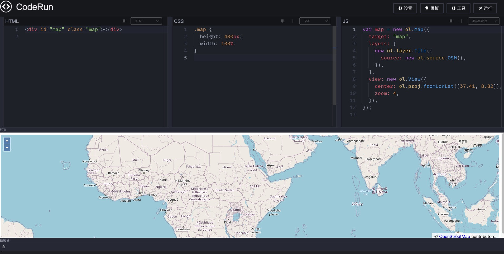
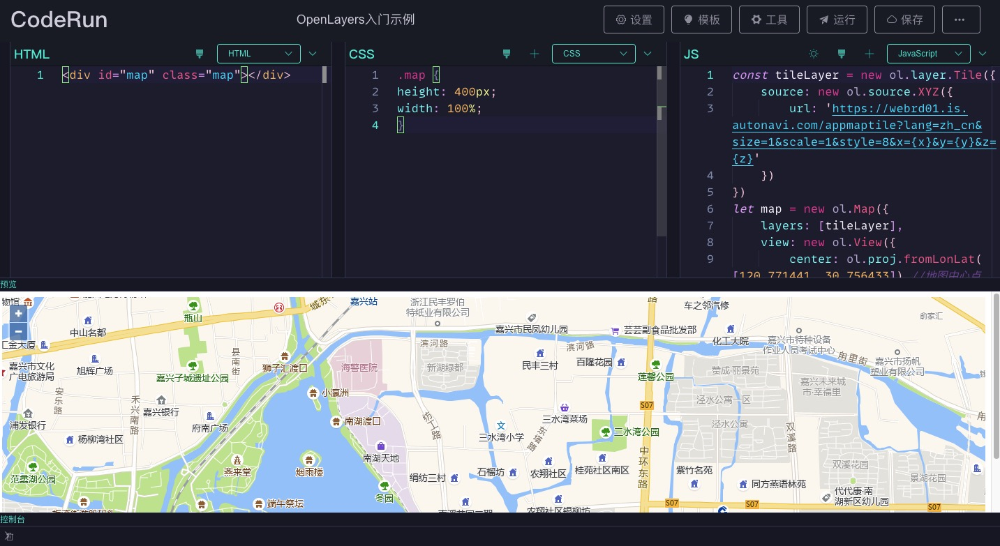
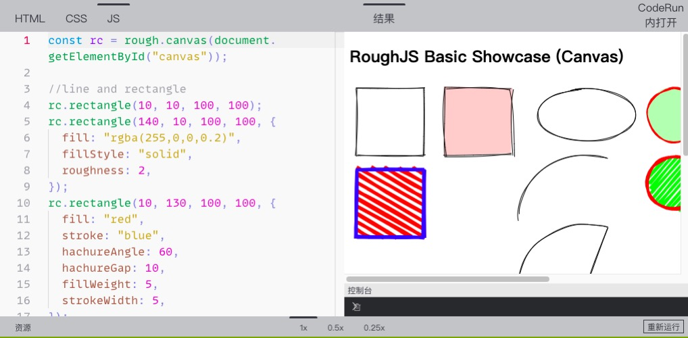

# code-run

一个代码在线编辑预览工具，类似`codepen`。

在线示例：[https://wanglin2.github.io/code-run-online/](https://wanglin2.github.io/code-run-online/)。

# 相关文章

[使用Skypack在浏览器上直接导入ES模块](https://juejin.cn/post/7094508128401621005)

[快速搭建一个代码在线编辑预览工具](https://juejin.cn/post/6965467528600485919)

[如何手动解析vue单文件并预览？](https://juejin.cn/post/7007725841689870366)

[手把手教你实现在Monaco Editor中使用VSCode主题](https://juejin.cn/post/7012514944579502116)

# 特性

- [x] 支持多种预处理语言

- [x] 支持多种布局随意切换

- [x] 支持添加额外的`css`、`js`资源

- [x] 内置多种常用模板

- [x] 支持导出`zip`

- [x] 支持代码格式化

- [x] 美观强大的控制台

- [x] 支持`vue`单文件（2.x、3.x）

- [x] 支持直接移植`VSCode`主题，并且已经内置了大量优质主题

- [x] 内置支持保存到github gist【[gist API](https://docs.github.com/cn/rest/reference/gists)】，想要保存到自己的存储体系修改也十分简单

- [x] 内置支持生成和[carbon](https://carbon.now.sh/)一样漂亮美观的代码图片

- [x] 内置使用[unpkg](https://unpkg.com/)及[importmap](https://github.com/WICG/import-maps)支持在浏览器上使用ES模块语法

- [x] 支持嵌入模式，方便在文档网站中使用，让文档示例更轻松

# 本地构建

```bash
git clone https://github.com/wanglin2/code-run.git

cd code-run

npm i

npm run serve
```

# 打包

## 修改应用基路径

请先确认打包后应用的基路径，项目默认的基路径为`code-run-online`，所以大部分情况下你都需要修改为你自己的路径，步骤如下：

1.修改`vue.config.js`文件里的`publicPath`字段。

2.修改`src/config/index.js`文件的`base`字段。

## 修改路由模式

默认的路由模式为`hash模式`，如果需要使用`history`模式请修改`src/config/index.js`文件的`routerMode`字段。

另外history模式下如果存在多级路径，可能需要修改以下文件：

1.修改`/public/index.html`文件的`prettier`相关`js`资源的路径；

## 打包命令

```bash
npm run build
```

# 项目主要技术

脚手架： `Vue CLI`

框架：`Vue 3.X`全家桶，通过`script setup`使用`组合式API`

UI库：`element-plus`

代码编辑器：`Monaco Editor`

# 界面截图







# 关于使用ESM

目前在`JavaScript`、`TypeScript`、`CoffeeScript`、`Vue3`、`Vue2`等模式下支持使用`ESM`，默认情况下，如果你直接按下列方式导入模块的话：

```js
import moment from 'moment'
```

最后会转换成：

```js
import moment from 'https://unpkg.com/moment?module'
```

也就是使用[unpkg](https://unpkg.com/)，但是有些模块`unpkg`获取不到`ESM`版本，或者直接这样获取到的版本不是我们所期望的，比如导入`vue`时，我们需要的是`https://unpkg.com/vue@3.2.37/dist/vue.esm-browser.js`，但是`https://unpkg.com/vue?module`默认返回的是`https://unpkg.com/vue@3.2.37/dist/vue.runtime.esm-bundler.js?module`，这个版本无法运行在浏览器上，所以这时候就可以通过手动添加[importmap](https://github.com/WICG/import-maps)来设置导入模块的来源。

# 主题新增教程

本教程针对迁移`VSCode`主题。

1.确定要新增的主题，先在本地`VSCode`上安装并切换到该主题，然后按`F1`或`Command/Control + Shift + P`或鼠标右键点击`Command Palette/命令面板`，接着找到并点击`Developer:Generate Color Theme From Current Setting/开发人员:使用当前设置生成颜色主题`，然后`VSCode`就会生成一份`json`数据，保存到项目的`/scripts/vscodeThemes/`目录下。

2.然后命令行执行命令`npm run convertTheme`，转换后的主题会被输出到项目的`/public/themes`目录下，接下来再执行命令`npm run createThemeList`即可生成主题配置，接下来即可在`设置->主题设置里看到所有主题，并可以切换使用`。

# 相关命令介绍

- `npm run buildConsole`：编译项目的`/public/console/index.js`文件为`ES5`语法，输出到同目录下的`compile.js`，该文件会在页面预览的`iframe`里进行加载，请勿直接修改`compile.js`文件。

- `npm run buildMonacoWorker`：打包`Monaco Editor`编辑器的`worker`文件，如果使用的`Monaco Editor`编辑器版本变化了需要重新打包。

- `npm run convertTheme`：将`VSCode`主题文件转换成`Monaco Editor`主题文件。

- `npm run createThemeList`：根据主题文件列表自动生成配置文件。

- `npm run buildVueSFCCompiler`：打包`@vue/compiler-sfc`文件，针对`Vue3`。

# 编译器更新指南

因为本项目是纯前端项目，所以在使用`less`、`sass`、`typescript`等预处理语言或扩展语言时需要在线进行编译，这个工作是由各个语言的编译器处理的，这些编译器你可以在`/public/parses/`目录下找到，随着时间的推移，肯定会落后于它们的新版本，所以你需要定期更新它们，获取它们的浏览器使用版本并不是一件易事，所以在这里将有些仅有的经验分享给大家。

- `less`

首先`npm i less`，然后在`node_modules`找到`less/dist/`目录，该目录下的两个文件都是`umd`格式的，可以直接使用。

- `sass`

`sass`目前使用的是这个项目[sass.js](https://github.com/medialize/sass.js)，但是这个项目已经三年没有更新了。

- `babel`

`babel`提供了浏览器使用版本，具体可以参考官方文档[@babel/standalone](https://babeljs.io/docs/en/babel-standalone)。

- `typescript`

`typescript`直接`npm i typescript`，然后找到`node_modules/typescript/lib/typescript.js`文件，它也是支持直接在浏览器上使用的。

- `coffeescript`

`coffeescript`也是直接`npm i coffeescript`，然后找到`node_modules/coffeescript/coffeescript-browser-compiler-legacy/coffeescript.js`文件，支持直接在浏览器上使用。

- `livescript`

`livescript`的浏览器使用版本可以直接去其官方仓库下载[browser](https://github.com/gkz/LiveScript/blob/master/browser/)，不过也两年没有更新了。

- 其他

`postcss`、`stylus`暂时没有找到浏览器使用版本或编译成功，知道的朋友欢迎提个`issue`。

# 新增代码模板

项目内置了几个常用的代码模板，可以根据需要进行增减，模板配置文件在`src/config/templates.js`。

# 新增页面布局模板

## 教程

项目内置了几个常用的页面布局模板，如果不满足你的需求也可以新增布局，一个布局就是一个`vue单文件`，可以在`src/pages/edit/layouts/`目录下找到所有布局，每个布局其实就是确定如何显示`编辑器`、`控制台`、`预览`三部分，`编辑器`包含`js`、`css`、`html`、`vue`四个编辑器，可配置显示哪几个、顺序、是否允许拖动等，需要新增的布局也需要放到该目录下。

接下来以新增一个`vue单文件的布局`为例来看，首先确定布局细节，我们想左侧显示一个`vue`编辑器，右侧显示`预览`和`控制台`，`预览`模块默认展开，`控制台`默认最小化：

1.首先我们在`layouts`目录下创建一个`VueSFC.vue`。

2.修改`src/config/constants.js`文件，引入该组件，并在`layoutList`和`layoutMap`两个配置上新增该布局：

```js
import VueSFC from '../pages/edit/layouts/VueSFC.vue'

export const layoutList = [
	// ...
	{
		name: 'Vue单文件',
		value: 'vue',
	}
]

export const layoutMap = {
	// ...
	vue: VueSFC
}
```

可以添加一张该布局的预览图片，放置到`src/assets/layoutImgs/`目录下，然后在`constants.js`文件里引入，最后在`previewImgMap`配置上添加即可。

这样修改完后即可在页面的`设置`功能里的`布局设置`的下拉列表里看到新增的`Vue单文件`选项。接下来完善`VueSFC.vue`的内容。

3.可参考其他布局结构的内容，复制过来修改，最终的内容应该是这样的：

```vue
<template>
  <!-- 该容器的直接DragItem直接数量为2，方向水平排列，第一个DragItem直接允许缩小到0，第二个DragItem组件最小允许缩小到20px -->
  <Drag :number="2" dir="h" :config="[{ min: 0 }, { min: 20 }]">
    <!-- 编辑器块，索引为0，禁止缩放该块，隐藏拖动条 -->
    <DragItem :index="0" :disabled="true" :showTouchBar="false">
      <!-- 编辑器增加，内部编辑器排列方向为垂直，配置了要显示的编辑器 -->
      <Editor dir="v" :showList="showList"></Editor>
    </DragItem>
    <!-- 预览&控制台，索引为1，允许拖动进行缩放 -->
    <DragItem :index="1" :disabled="false">
      <!-- DragItem又嵌套了一个容器组件，该容器的直接DragItem直接数量为2，方向垂直排列，第一个DragItem直接允许缩小到0，第二个DragItem组件默认显示的高度为48px，且最小允许缩小到48px -->
      <Drag :number="2" dir="v" :config="[{ min: 0 }, { min: 48, default: 48 }]">
        <DragItem
          :index="0"
          :disabled="true"
          :showTouchBar="false"
          title="预览"
        >
          <Preview></Preview>
        </DragItem>
        <DragItem :index="1" :disabled="false" title="控制台">
          <Console></Console>
        </DragItem>
      </Drag>
    </DragItem>
  </Drag>
</template>

<script setup>
import Editor from '@/components/Editor.vue'
import Preview from '@/components/Preview.vue'
import Console from '@/components/Console.vue'
import Drag from '@/components/Drag.vue'
import DragItem from '@/components/DragItem.vue'
import { reactive } from 'vue'

// 配置只显示vue编辑器
const showList = reactive([
    {
        title: 'VUE',// 编辑器名称
        disableDrag: true,// 禁止拖动进行缩放
        showTouchBar: false// 隐藏推动条
    }
])
</script>
```

注释已经解释的很详细，详情可参考接下来的组件文档。

## 布局相关组件文档

### Drag组件

该组件相当于是一个容器，每个容器会实例化一个`Resize`尺寸拖动调整类，内部需要放置`DragItem`组件。

组件`props`：

|   名称   |   介绍   |   类型   |   默认值   |
| ---- | ---- | ---- | ---- |
|   dir   |   容器内部的`DragItem`组件排列方式，可选项：h（水平排列）、v（垂直排列）   |   String   |   h   |
|   number   |   内部的`DragItem`组件数量   |   Number   |   0   |
|   config   |   配置内部的`DragItem`组件的信息，数组类型，每一项都是一个对象，具体的属性请看表1   |   Array   |   []   |

#### 表1

`config`数组每一项的对象的属性：

|   名称   |   介绍   |   类型   |   默认值   |
| ---- | ---- | ---- | ---- |
|   default   |   对应索引的`DragItem`组件默认显示的尺寸，`dir`为`h`时指宽度，为`v`时指高度   |   Number   |   默认容器内的所有`DragItem`组件平分空间   |
|   min   |   对应索引的`DragItem`组件允许显示的最小尺寸，当发生拖动时，如果该组件空间被挤压，默认允许被压缩到0，即完全不显示，如果配置了该属性，则缩小到配置的大小后不再变化   |   Number   |   0   |
|   max   |   对应索引的`DragItem`组件允许显示的最大尺寸，当发生拖动时，如果该组件空间被增加，默认会增加到允许的最大尺寸，如果配置了该属性，则增加到配置的大小后不再变化   |   Number   |   0   |

### DragItem组件

该组件代表一个可拖动的块，需要放置在`Drag`组件下，通过`slot`来传入需要实际显示的内容。`DragItem`组件内可再嵌套`Drag`容器。

组件`props`：

|   名称   |   介绍   |   类型   |   默认值   |
| ---- | ---- | ---- | ---- |
|   disabled   |   是否禁止拖动   |   Boolean   |   false   |
|   touchBarSize   |   拖动条的尺寸，`dir`为`h`时指宽度，为`v`时指高度   |   Number   |   20   |
|   index   |   该组件在容器内的同级`DragItem`组件列表中的索引，从0开始   |   Number   |   0   |
|   showTouchBar   |   是否显示拖动条   |   Boolean   |   true   |
|   title   |   标题   |   String   |      |
|   hide   |   是否隐藏该组件   |   Boolean   |   false   |

### Editor组件

该组件目前包含`js`、`css`、`html`、`vue`四个编辑器，可以控制具体显示哪几个，以及它们的排列方式。

组件`props`：

|   名称   |   介绍   |   类型   |   默认值   |
| ---- | ---- | ---- | ---- |
|   hide   |   是否隐藏编辑器   |   Boolean   |   false   |
|   dir   |   排布方向，v（垂直）、h（水平）   |   String   |   h   |
|   showList   |   要显示的编辑器列表，数组类型，每一项可以是数字也可以是一个对象，见表2   |   Array   |   ['HTML', 'CSS', 'JS']   |

#### 表2

`showList`数组的每一项可以是一个字符串，可选值为：`HTML`、 `CSS`、 `JS`、`VUE`，代表四种编辑器，配置了哪几个就显示哪几个。

如果需要再配置一些属性，比如是否允许该编辑器拖动等等，可配置的属性如下：

|   名称   |   介绍   |   类型   |   默认值   |
| ---- | ---- | ---- | ---- |
|   title   |   编辑器名称，可选项：`HTML`、 `CSS`、 `JS`、`VUE`   |   String   |      |
|   disableDrag   |   是否禁止拖动缩放该编辑器   |   Boolean   |      |
|   showTouchBar   |   是否显示该编辑器的推动条   |   Boolean   |      |

# 暂未解决的问题

1.生成代码图片功能偶尔生成的图片高度超出了代码实际的高度，目前暂未找到原因及根本解决方法。可选方法之一为生成图片后再提供一个图片裁剪的功能。

2.极少数情况下会出现主题不生效的问题。

# 致谢

本项目中预处理/扩展语言的编译部分、其他一些细节有参考了项目[codepan](https://github.com/egoist/codepan)的实现。

# License

[MIT](https://opensource.org/licenses/MIT)
