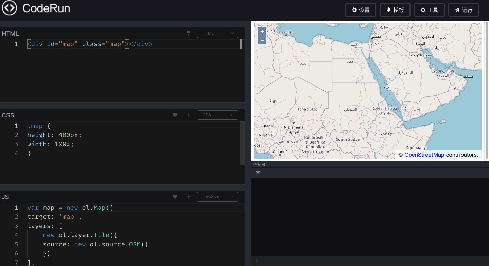
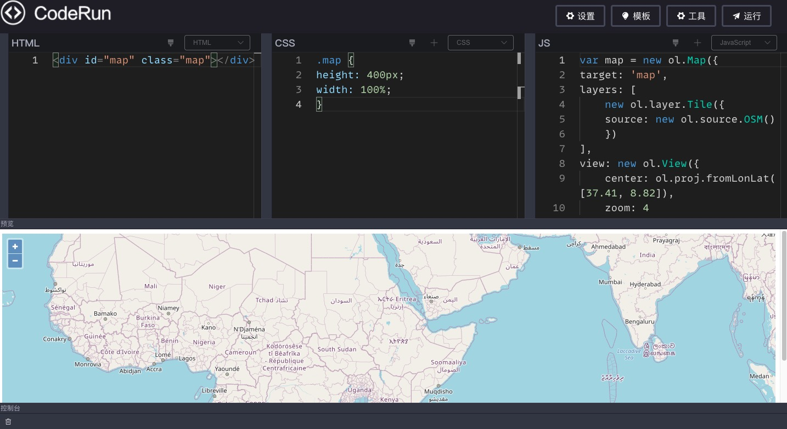

# code-run

一个代码在线编辑预览工具，类似`codepen`。

在线使用：[http://lxqnsys.com/code-run/](http://lxqnsys.com/code-run/)，在线版支持用户登录相关功能，支持云端保存与分享，本仓库的代码不包含该部分功能，如有需要，可邮件联系：`1013335014@qq.com`。

项目设计思路及开发过程可参考文章：[https://juejin.cn/post/6965467528600485919](https://juejin.cn/post/6965467528600485919)。

# 特性

- [x] 支持多种预处理语言

- [x] 支持多种布局随意切换

- [x] 支持添加额外的`css`、`js`资源

- [x] 内置多种常用模板

- [x] 支持导出`zip`

- [x] 支持代码格式化

- [x] 美观强大的控制台

- [x] 支持`vue`单文件

- [x] 内置多种代码主题

# 安装

`npm`安装其实没啥用，推荐还是进行下一步的【本地构建】。

```bash
npm i @wanglin1994/code-run
```

# 本地构建

```bash
git clone https://github.com/wanglin2/code-run.git

cd code-run

npm i

npm run dev
```

# 打包

## 修改应用基路径

请先确认打包后应用的基路径，项目默认的基路径为`code-run-online`，所以大部分情况下你都需要修改为你自己的路径，步骤如下：

1.修改`vite.config.js`文件里的`base`字段。

2.修改`index.html`文件里的【Monaco Editor的模块系统配置】的`require.paths.vs`配置。

3.修改`src/config/index.js`文件的`base`字段。

## 修改路由模式

默认的路由模式为`hash模式`，如果需要使用`history`模式请修改`src/config/index.js`文件的`routerMode`字段。

## 打包命令

```bash
npm run build
```

# 项目主要依赖

构建工具： `Vite`

视图库：`VUE 3.X`

UI库：`element-plus`

编辑器：`Monaco Editor`

# 界面截图





# 主题新增教程

本教程针对迁移vscode主题。

1.确定要新增的主题，先在本地vscode上安装并切换到该主题，然后去[vscode主题商店](https://marketplace.visualstudio.com/search?target=VSCode&category=Themes&sortBy=Installs)搜索该主题，进入主题详情页面后点击右侧的【Download Extension】按钮下载该主题。

2.找到刚才下载的vscode主题，文件应该是以.vsix结尾的，直接把该后缀改成.zip，然后解压缩，打开其中的/extension/themes/文件夹，里面的.json文件即主题文件，打开该文件。

3.在本项目的/public/themes/目录下新增主题文件，文件名即主题名，内容模板可复制example.js里面的【内容模板】,如果新增的是亮色主题，那么`base`选项使用`vs`，暗色主题，`base`选项修改为`vs-dark`, 然后去/src/config/constants.js文件里找到【codeThemeList】配置，新增一项，`value`值即刚才创建的文件名，现在即可以在设置里切换到该主题。

4.接下来填充刚才创建的主题文件，【colors】选项直接去复制最开始打开的主题文件里的【colors】选项的内容。【rules】选项里的每一个`foreground`字段代表该`token`的颜色，可以打开/public/themes/目录下的三个测试文件：`test.js`、`test.css`、`test.html`，然后根据【rules】选项里的每一项的`token`注释，找到在测试文件里的对应内容，比如要确定【注释】`comment`的颜色，可以打开`test.js`文件，然后使用快捷键`command + shift + p`，然后找到并点击`Developer:Inspect Editor Tokens and Scopes`，然后再将鼠标点击到【注释】代码上，就会显示出该注释对应的颜色，复制并粘贴到【rules】选项里即可，注意【rules】里的颜色值不需要带`#`，颜色值全部填充完即可刷新页面查看效果。

# 新增代码模板

项目内置了几个常用的代码模板，可以根据需要进行增减，模板配置文件在`src/config/templates.js`。

# 新增页面布局模板

## 教程

项目内置了几个常用的页面布局模板，如果不满足你的需求也可以新增布局，一个布局就是一个`vue单文件`，可以在`src/pages/edit/layouts/`目录下找到所有布局，每个布局其实就是确定如何显示`编辑器`、`控制台`、`预览`三部分，`编辑器`包含`js`、`css`、`html`、`vue`四个编辑器，可配置显示哪几个、顺序、是否允许拖动等，需要新增的布局也需要放到该目录下。

接下来以新增一个`vue单文件的布局`为例来看，首先确定布局细节，我们想左侧显示一个`vue`编辑器，右侧显示`预览`和`控制台`，`预览`模块默认展开，`控制台`默认最小化：

1.首先我们在`layouts`目录下创建一个`VueSFC.vue`。

2.修改`src/config/constants.js`文件，引入该组件，并在`layoutList`和`layoutMap`两个配置上新增该布局：

```js
import VueSFC from '../pages/edit/layouts/VueSFC.vue'

export const layoutList = [
	// ...
	{
		name: 'Vue单文件',
		value: 'vue',
	}
]

export const layoutMap = {
	// ...
	vue: VueSFC
}
```

可以添加一张该布局的预览图片，放置到`src/assets/layoutImgs/`目录下，然后在`constants.js`文件里引入，最后在`previewImgMap`配置上添加即可。

这样修改完后即可在页面的`设置`功能里的`布局设置`的下拉列表里看到新增的`Vue单文件`选项。接下来完善`VueSFC.vue`的内容。

3.可参考其他布局结构的内容，复制过来修改，最终的内容应该是这样的：

```vue
<template>
  <!-- 该容器的直接DragItem直接数量为2，方向水平排列，第一个DragItem直接允许缩小到0，第二个DragItem组件最小允许缩小到20px -->
  <Drag :number="2" dir="h" :config="[{ min: 0 }, { min: 20 }]">
    <!-- 编辑器块，索引为0，禁止缩放该块，隐藏拖动条 -->
    <DragItem :index="0" :disabled="true" :showTouchBar="false">
      <!-- 编辑器增加，内部编辑器排列方向为垂直，配置了要显示的编辑器 -->
      <Editor dir="v" :showList="showList"></Editor>
    </DragItem>
    <!-- 预览&控制台，索引为1，允许拖动进行缩放 -->
    <DragItem :index="1" :disabled="false">
      <!-- DragItem又嵌套了一个容器组件，该容器的直接DragItem直接数量为2，方向垂直排列，第一个DragItem直接允许缩小到0，第二个DragItem组件默认显示的高度为48px，且最小允许缩小到48px -->
      <Drag :number="2" dir="v" :config="[{ min: 0 }, { min: 48, default: 48 }]">
        <DragItem
          :index="0"
          :disabled="true"
          :showTouchBar="false"
          title="预览"
        >
          <Preview></Preview>
        </DragItem>
        <DragItem :index="1" :disabled="false" title="控制台">
          <Console></Console>
        </DragItem>
      </Drag>
    </DragItem>
  </Drag>
</template>

<script setup>
import Editor from '@/components/Editor.vue'
import Preview from '@/components/Preview.vue'
import Console from '@/components/Console.vue'
import Drag from '@/components/Drag.vue'
import DragItem from '@/components/DragItem.vue'
import { reactive } from 'vue'

// 配置只显示vue编辑器
const showList = reactive([
    {
        title: 'VUE',// 编辑器名称
        disableDrag: true,// 禁止拖动进行缩放
        showTouchBar: false// 隐藏推动条
    }
])
</script>
```

注释已经解释的很详细，详情可参考接下来的组件文档。

## 布局相关组件文档

### Drag组件

该组件相当于是一个容器，每个容器会实例化一个`Resize`尺寸拖动调整类，内部需要放置`DragItem`组件。

组件`props`：

|   名称   |   介绍   |   类型   |   默认值   |
| ---- | ---- | ---- | ---- |
|   dir   |   容器内部的`DragItem`组件排列方式，可选项：h（水平排列）、v（垂直排列）   |   String   |   h   |
|   number   |   内部的`DragItem`组件数量   |   Number   |   0   |
|   config   |   配置内部的`DragItem`组件的信息，数组类型，每一项都是一个对象，具体的属性请看表1   |   Array   |   []   |

#### 表1

`config`数组每一项的对象的属性：

|   名称   |   介绍   |   类型   |   默认值   |
| ---- | ---- | ---- | ---- |
|   default   |   对应索引的`DragItem`组件默认显示的尺寸，`dir`为`h`时指宽度，为`v`时指高度   |   Number   |   默认容器内的所有`DragItem`组件平分空间   |
|   min   |   对应索引的`DragItem`组件允许显示的最小尺寸，当发生拖动时，如果该组件空间被挤压，默认允许被压缩到0，即完全不显示，如果配置了该属性，则缩小到配置的大小后不再变化   |   Number   |   0   |
|   max   |   对应索引的`DragItem`组件允许显示的最大尺寸，当发生拖动时，如果该组件空间被增加，默认会增加到允许的最大尺寸，如果配置了该属性，则增加到配置的大小后不再变化   |   Number   |   0   |

### DragItem组件

该组件代表一个可拖动的块，需要放置在`Drag`组件下，通过`slot`来传入需要实际显示的内容。`DragItem`组件内可再嵌套`Drag`容器。

组件`props`：

|   名称   |   介绍   |   类型   |   默认值   |
| ---- | ---- | ---- | ---- |
|   disabled   |   是否禁止拖动   |   Boolean   |   false   |
|   touchBarSize   |   拖动条的尺寸，`dir`为`h`时指宽度，为`v`时指高度   |   Number   |   20   |
|   index   |   该组件在容器内的同级`DragItem`组件列表中的索引，从0开始   |   Number   |   0   |
|   showTouchBar   |   是否显示拖动条   |   Boolean   |   true   |
|   title   |   标题   |   String   |      |
|   hide   |   是否隐藏该组件   |   Boolean   |   false   |

### Editor组件

该组件目前包含`js`、`css`、`html`、`vue`四个编辑器，可以控制具体显示哪几个，以及它们的排列方式。

组件`props`：

|   名称   |   介绍   |   类型   |   默认值   |
| ---- | ---- | ---- | ---- |
|   hide   |   是否隐藏编辑器   |   Boolean   |   false   |
|   dir   |   排布方向，v（垂直）、h（水平）   |   String   |   h   |
|   showList   |   要显示的编辑器列表，数组类型，每一项可以是数字也可以是一个对象，见表2   |   Array   |   ['HTML', 'CSS', 'JS']   |

#### 表2

`showList`数组的每一项可以是一个字符串，可选值为：`HTML`、 `CSS`、 `JS`、`VUE`，代表四种编辑器，配置了哪几个就显示哪几个。

如果需要再配置一些属性，比如是否允许该编辑器拖动等等，可配置的属性如下：

|   名称   |   介绍   |   类型   |   默认值   |
| ---- | ---- | ---- | ---- |
|   title   |   编辑器名称，可选项：`HTML`、 `CSS`、 `JS`、`VUE`   |   String   |      |
|   disableDrag   |   是否禁止拖动缩放该编辑器   |   Boolean   |      |
|   showTouchBar   |   是否显示该编辑器的推动条   |   Boolean   |      |